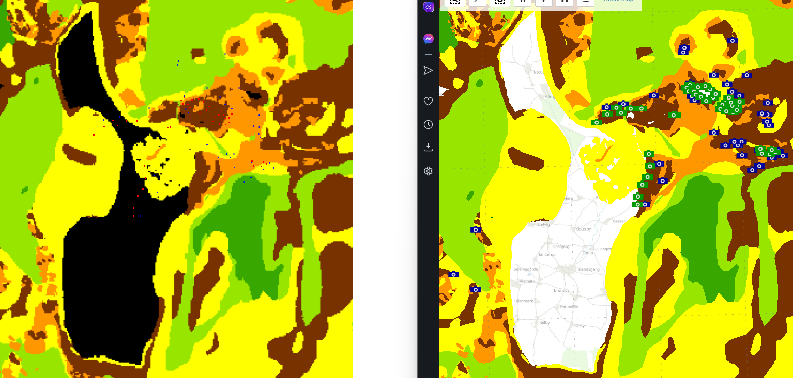

# Kig Under Vandet - Aalborg University
## _GEUS data training_

## Description
- Download data from GEUS MARTA in form of points, video, images, and seabed sediments. 
- Classify each points according to seabed sediments.
- Process each point with downloaded media.
Data source: [Geus Marta data](
https://data.geus.dk/geusmap/?mapname=marta#baslay=baseMapDa&optlay=&extent=19081.47838710714,5990066.985780745,1043081.4783871071,6481066.985780745)

## QGIS guide and resources
- _"QGIS_WMS_manual_guide.pdf"_ - Selfmade manual for opening WMS server data in QGIS
- _"qgis_project.qgz"_ - Selfmade QGIS project with sediment, images, and videos
- _"GEUS_MARTA_WMS.xml"_ [GEUS QGIS](https://data.geus.dk/geusmapmore/qgis/qgis_dk.html)
- [10.1. Lesson: Web Mapping Services (WMS)](https://docs.qgis.org/3.28/en/docs/training_manual/online_resources/wms.html)
- [Export Data in GeoTIFF formats](https://maps.cga.harvard.edu/qgis_2/wkshop/export_GeoTiff.php)

## Warning
- Do not upload the _"seabed_sediments_map.tif"_ to Github, as it is too big.
  
## Run
- Process media files:
  - Write _"call_method"_ to handle each media.
  - Remove _"limit"_ parameter.
  - Run _"download_medias_xml.py"_
- Classify seabed points:
  - Download and insert the _"seabed_sediments_map.tif"_ file. Link found in "Resources".
  - Run _"classify_points"_.

## Presentation
Points on map with seabed (🔴=image, 🔵=video). Shows the precision of the points according to actual file

  
  

Graphs classified data

  
   

## Features
1. Download "image" and "video" XML files, and filter points with point id and coordinates. _("download_points.py")_
2. Download all images or videos from Geus Marta Map into a 'downloads' file from the XML point file, and process. _("download_medias.xml.py")_
3. Sample points on map according to seabed sediments _("sample_points_on_map")_

## Resources
- __points.xml__ (existing of point id, coordinates, and seabed classification)
- __marta_video.xml__ [Video points XML data](data.geus.dk/geusmap/ows/25832.jsp?nocache=nocache&whoami=178.157.255.197&typename=marta_video&service=WFS&version=1.0.0&mapname=marta&maxfeatures=7000&outputformat=gml2&request=GetFeature)
- __marta_image.xml__ [Image points XML data](https://data.geus.dk/geusmap/ows/25832.jsp?nocache=nocache&whoami=178.157.255.197&typename=marta_images&service=WFS&version=1.0.0&mapname=marta&maxfeatures=7000&outputformat=gml2&request=GetFeature)
- __seabed_sediments_map.tif__ (Download link: [https://we.tl/t-hCZY6itJPa](https://we.tl/t-hCZY6itJPa))

### Contributors
- Tonko Bossen, Aalborg University

## License - MIT
